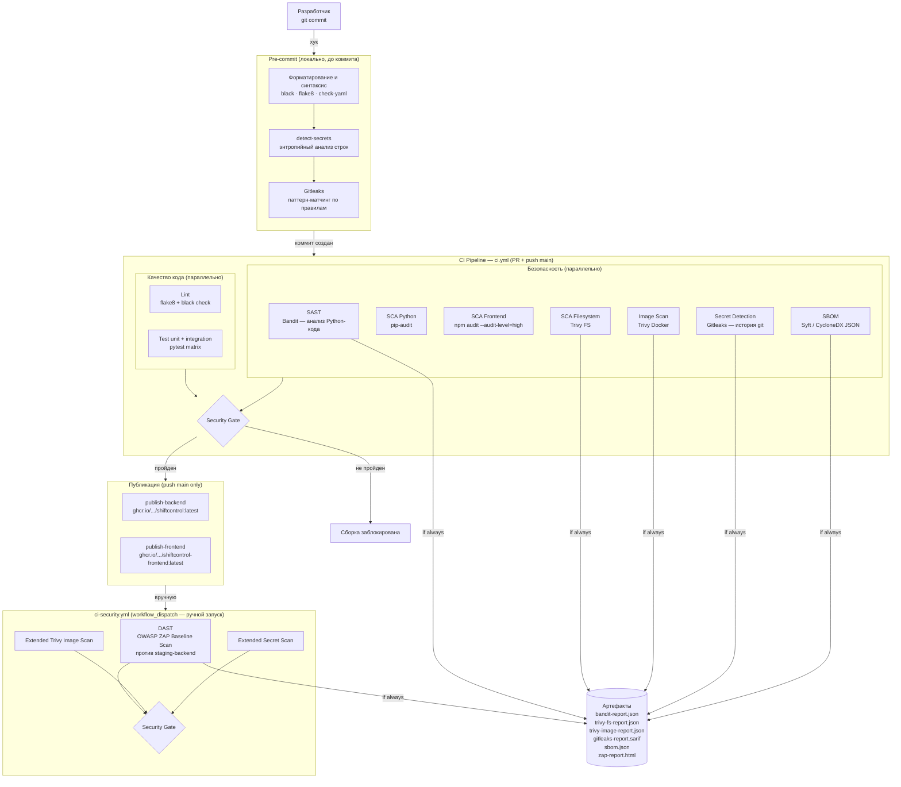

# Security Pipeline — ShiftControl

## Архитектура конвейера безопасности

Конвейер состоит из двух уровней: **pre-commit** (локально, до попадания кода в репозиторий) и **CI/CD** (автоматически на каждый PR и push в `main`, плюс ручной запуск расширенного сканирования).



---

## 4.1 Описание этапов и обоснование порядка

### Почему именно такой порядок

| Этап | Уровень | Обоснование |
|------|---------|-------------|
| Pre-commit (локально) | До коммита | Мгновенная обратная связь — разработчик видит ошибку до попадания в репозиторий. Дешевле всего исправить здесь. |
| SAST (Bandit) | До сборки образа | Статический анализ работает на исходном коде — не нужен рабочий контейнер. Выявляет архитектурные проблемы (SQL injection, hardcoded passwords, insecure deserialization) до того, как они попадут в образ. |
| SCA (pip-audit, npm audit, Trivy FS) | До сборки образа | Уязвимые зависимости проверяются по манифестам (`requirements.txt`, `package-lock.json`) — не нужен запущенный процесс. Блокирует сборку если зависимость уязвима. |
| Image Scan (Trivy) | После сборки образа | Trivy сканирует финальный Docker-образ, включая OS-пакеты. Требует собранного образа, поэтому идёт после build-шага. |
| Secret Detection (Gitleaks) | Параллельно с другими | Независим от сборки — сканирует git-историю. Параллельный запуск не замедляет pipeline. |
| SBOM (Syft) | Параллельно с другими | Инвентаризация компонентов — информационный шаг, не блокирует. |
| DAST (OWASP ZAP) | После деплоя на staging | DAST требует работающего приложения. Запускать до деплоя невозможно — нет HTTP-сервера. Тестирует поведение системы в runtime: XSS, CSRF, SQL Injection через реальные HTTP-запросы. |

### Инструменты детально

#### SAST — Bandit

Bandit анализирует Python AST (Abstract Syntax Tree) без запуска кода.

**Обнаруживает:**
- Использование небезопасных функций (`eval`, `exec`, `pickle.loads`)
- SQL-инъекции через конкатенацию строк
- Hardcoded passwords / секреты в коде
- Небезопасные хэш-функции (MD5, SHA1 для паролей)
- Небезопасные random (`random` вместо `secrets`)
- Уязвимые конфигурации TLS/SSL
- Shell injection через `subprocess` с `shell=True`

**Ограничения:** не анализирует runtime-поведение, не находит логические уязвимости.

#### SCA — pip-audit

Проверяет Python-зависимости из `requirements.txt` против OSV (Open Source Vulnerabilities) базы данных.

**Обнаруживает:**
- Известные CVE в Python-пакетах (PyPI)
- Устаревшие версии с публично известными уязвимостями

#### SCA — npm audit

Проверяет npm-зависимости из `package-lock.json` против npm Advisory Database.

**Обнаруживает:**
- CVE в frontend JavaScript-пакетах
- Уязвимые транзитивные зависимости

#### SCA — Trivy Filesystem

Сканирует все манифесты зависимостей в репозитории.

**Обнаруживает:**
- CVE в Python (`requirements.txt`), Node.js (`package-lock.json`), Go (`go.sum`), Java (`pom.xml`) зависимостях
- Уязвимости в `Dockerfile` инструкциях (неправильные COPY, USER)
- Секреты в конфигурационных файлах

#### Image Scan — Trivy Docker

Сканирует финальный Docker-образ.

**Обнаруживает:**
- CVE в OS-пакетах (Debian/Alpine)
- CVE во вложенных интерпретаторах и runtime
- Уязвимые Python/Node пакеты внутри образа
- Небезопасные конфигурации контейнера

#### Secret Detection — Gitleaks

Сканирует полную историю git с момента первого коммита.

**Обнаруживает:**
- API keys, токены, пароли в коде и конфигурации
- Секреты, которые были удалены из текущего кода, но остались в истории
- Кастомные паттерны (4 правила ShiftControl: SECRET_KEY, DB credentials, SMTP, JWT)

#### DAST — OWASP ZAP Baseline Scan

ZAP (Zed Attack Proxy) выполняет активное тестирование работающего приложения.

**Обнаруживает:**
- XSS (Cross-Site Scripting)
- SQL Injection через реальные HTTP-запросы
- CSRF (Cross-Site Request Forgery)
- Небезопасные HTTP-заголовки (отсутствие CSP, X-Frame-Options, HSTS)
- Открытые директории, verbose error messages
- OWASP Top 10 категории (A01–A10:2021)

**Ограничения:** baseline scan — пассивный + ограниченный активный режим, не исчерпывает все векторы атак.

---

## 4.2 Quality Gates

### Пороги блокировки

| Проверка | Инструмент | Блокировать при | Предупреждение при | Реализация |
|----------|------------|----------------|-------------------|------------|
| SAST | Bandit | HIGH severity | MEDIUM severity | `-lll` (HIGH+) = exit 1; отдельный шаг для MEDIUM-отчёта |
| SCA Python | pip-audit | Любой CVE (по умолчанию блокирует) | — | `pip-audit -r requirements.txt` |
| SCA Frontend | npm audit | HIGH+ CVE | MEDIUM CVE | `--audit-level=high` |
| SCA Filesystem | Trivy FS | CRITICAL/HIGH CVE с доступным фиксом | MEDIUM CVE | `severity: CRITICAL,HIGH` + `ignore-unfixed: true` |
| Image Scan | Trivy | CRITICAL/HIGH CVE с доступным фиксом | MEDIUM CVE | `severity: CRITICAL,HIGH` + `ignore-unfixed: true` |
| Secret Detection | Gitleaks | Любой обнаруженный секрет | — | exit-code 1 при любой находке |
| DAST | OWASP ZAP | OWASP Top 10 уязвимости (Medium+) | Информационные | `fail_action: true` + `-I` (ignore info) |

### Поведение Security Gate

```
Security Gate FAILED → publish-backend и publish-frontend НЕ запускаются
Security Gate PASSED → публикация разрешена (только push в main)
```

**Важно:** `ignore-unfixed: true` в Trivy означает, что CVE без доступного патча не блокируют pipeline. Это обоснованно — разработчик не может устранить CVE, если мейнтейнер пакета ещё не выпустил исправление. Такие CVE фиксируются в `trivy-image-report.json` и ревьюируются вручную.

### Принцип "fail fast"

Порядок запуска обеспечивает раннее обнаружение:
1. Pre-commit — миллисекунды, до коммита
2. SAST/SCA — секунды, до сборки образа
3. Image Scan — минуты, после build
4. DAST — минуты, после деплоя на staging (ручной запуск)

Более дорогие проверки (DAST, Image Scan) запускаются только если дешёвые (SAST, SCA) прошли успешно.
